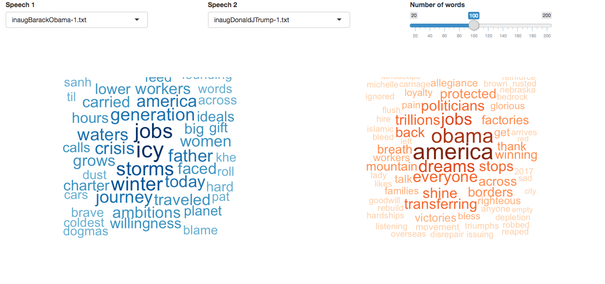

-------

#### Introduction

Inaugural speech is the first speech made by a President at a ceremony called the inauguration. Every four years, every U.S. president need to speak to the public about future plans and resolutions. The inauguration has been highly anticipated since President George Washington's first inaugural speech in 1789. Since then, there have been 58 inaugural speeches and many of them are very famous and impressive. The most controversial inaugural speech recently should from the 45th President Donald Trump in January 2017, who would also be one of the most controversial presidents in the U.S. history.

In this project I will transfer all the President's inauguration speeches into data to analyse *What they said at their inauguration?* *What are the similarities and differences from these speeches?* *What is the differences between speech styles?* Finally, I'll take a look at the similarities and differences between the two presidents *Barack Obama* and *Donald Trump*, which we are more familiar with, to see if the conclusions are consistent with what we think.


##### Key Words of All The Speeches

First of all, I'd like to use word-cloud to visualize the all the presidents' speech content, which will gives us a clear image of the words with high frequency appeared in the speeches. After collected data and did some text processing, we get an image below. 

```{r, message=FALSE, warning=FALSE, echo = FALSE}
###Install Packages and load libraries

packages.used=c("tm", "gplots", "rvest", "tibble", "qdap", "sentimentr", "gplots", "syuzhet", "factoextra", "beeswarm", "scales", "RANN", "topicmodels", "wordcloud", "RColorBrewer", "dplyr", "tidytext")

# check packages that need to be installed.
packages.needed=setdiff(packages.used, 
                        intersect(installed.packages()[,1], 
                                  packages.used))
# install additional packages
if(length(packages.needed)>0){
  install.packages(packages.needed, dependencies = TRUE,
                   repos='http://cran.us.r-project.org')
}

library(tm)
library(wordcloud)
library(RColorBrewer)
library(dplyr)
library(tidytext)
library(rvest)
library(tibble)
library(qdap)
library(sentimentr)
library(gplots)
library(syuzhet)
library(factoextra)
library(beeswarm)
library(scales)
library(RANN)
library(topicmodels)

source("../lib/plotstacked.R")
source("../lib/speechFuncs.R")
```


```{r, echo = FALSE}
###Collect data and read the speeches

inaug.list=read.csv("../data/InaugurationInfo.csv", stringsAsFactors = FALSE)

folder.path="../data/InauguralSpeeches/"
speeches=list.files(path = folder.path, pattern = "*.txt")
ff.all<-Corpus(DirSource(folder.path))
```


```{r, echo = FALSE}
###Text processing

ff.all<-tm_map(ff.all, stripWhitespace)
ff.all<-tm_map(ff.all, content_transformer(tolower))
ff.all<-tm_map(ff.all, removeWords, stopwords("english"))
ff.all<-tm_map(ff.all, removeWords, character(0))
ff.all<-tm_map(ff.all, removePunctuation)


tdm.all<-TermDocumentMatrix(ff.all)

tdm.tidy=tidy(tdm.all)

tdm.overall=summarise(group_by(tdm.tidy, term), sum(count))
```


```{r, fig.width=10, fig.height=7, echo = FALSE}
###Inspect an overall wordcloud

wordcloud(tdm.overall$term, tdm.overall$`sum(count)`,
          scale=c(7,0.5),
          max.words=200,
          min.freq=1,
          random.order=FALSE,
          rot.per=0.3,
          use.r.layout=T,
          random.color=F,
          colors=brewer.pal(9,"Reds"))
```
 
From the image, we find there are some words without specific meanings, like "will", "can", "must", "shall", etc., which are all words to form a sentence. So obviously, these words will have high frequencies appear in the speech content. Ignoring these words, we see the words "government", "people", "united", "states", "nation", "country", etc. are also the main words from the speeches. Since inaugural speeches persistently demonstrated American ideological values over time [1], these words appear as the most frequency words are not surprising and also these words are not easily changed over time. Then, let's look at some of the words that appear on the periphery. We see the words "peace", "freedom", "hope", "liberty", "justice", "war", etc., which we can think of these words as the topic of the speeches. Although, from the first speech in 1789 to the present, the United States has experienced many major historical events, such as Civil War, Great Depression, Cold War and others, the theme of the speech seems basically fixed on several specific topics.

[1] Project 1 [Description](doc/)


##### What Topics Are Include In The Speeches?

To explore the topics in all the speeches, we need to do some text mining work and use the topic modeling approach to help us analyze these specific topics. I will use LDA method to divide the words in the speeches into 15 categories. Through the analysis of these 15 sets of words, we set a topic for each group of words, as shown in the figure below are Economy, America, Defense, Belief, Election, Patriotism, Unity, Government, Reform, Temporal, WorkingFamilies, Freedom, Equality, Misc and Legislation. (Here I directly refer to the topic name in the tutorial made by professor.)

```{r, message=FALSE, warning=FALSE, echo=F}
###Genrate list of sentences

setwd("~/Desktop/5243-ADS/Spring2018-Project1-fangbingliu/data/InauguralSpeeches")
files = paste0("inaug",paste(inaug.list$File, inaug.list$Term, sep = "-"),".txt")
speech.list = NULL
for(i in 1:length(files)){
  sp = paste(readLines(files[i], n=-1, skipNul=TRUE), collapse=" ")
  speech.list = c(speech.list, sp)
}
speech.list = data.frame(fulltext = speech.list)

sentence.list=NULL
for(i in 1:nrow(speech.list)){
  sentences=sent_detect(speech.list$fulltext[i],
                        endmarks = c("?", ".", "!", "|",";"))
  if(length(sentences)>0){
    emotions=get_nrc_sentiment(sentences)
    word.count=word_count(sentences)
    emotions=diag(1/(word.count+0.01))%*%as.matrix(emotions)
    sentence.list=rbind(sentence.list, 
                        cbind(speech.list[i,-ncol(speech.list)],
                              sentences=as.character(sentences), 
                              word.count,
                              emotions,
                              sent.id=1:length(sentences), File = inaug.list$File[i],
                              Term = inaug.list$Term[i]
                        )
    )
  }
}
# some non-sentences exist in raw data due to erroneous extra end-of sentence marks
sentence.list=
  sentence.list%>%
  filter(!is.na(word.count))
```


```{r, echo = F}
## Topic modeling
## generate corpus list
corpus.list=sentence.list[2:(nrow(sentence.list)-1), ]
sentence.pre=sentence.list$sentences[1:(nrow(sentence.list)-2)]
sentence.post=sentence.list$sentences[3:(nrow(sentence.list)-1)]
corpus.list$snipets=paste(sentence.pre, corpus.list$sentences, sentence.post, sep=" ")
rm.rows=(1:nrow(corpus.list))[corpus.list$sent.id==1]
rm.rows=c(rm.rows, rm.rows-1)
corpus.list=corpus.list[-rm.rows, ]
```


```{r, echo = F}
## Text mining
docs <- Corpus(VectorSource(corpus.list$snipets))
#writeLines(as.character(docs[[sample(1:nrow(corpus.list), 1)]]))
```


```{r, echo = F}
## Text basic processing
#remove potentially problematic symbols
docs <-tm_map(docs,content_transformer(tolower))
#writeLines(as.character(docs[[sample(1:nrow(corpus.list), 1)]]))

#remove punctuation
docs <- tm_map(docs, removePunctuation)

#writeLines(as.character(docs[[sample(1:nrow(corpus.list), 1)]]))

#Strip digits
docs <- tm_map(docs, removeNumbers)
#writeLines(as.character(docs[[sample(1:nrow(corpus.list), 1)]]))

#remove stopwords
docs <- tm_map(docs, removeWords, stopwords("english"))
#writeLines(as.character(docs[[sample(1:nrow(corpus.list), 1)]]))

#remove whitespace
docs <- tm_map(docs, stripWhitespace)
#writeLines(as.character(docs[[sample(1:nrow(corpus.list), 1)]]))

#Stem document
docs <- tm_map(docs,stemDocument)
#writeLines(as.character(docs[[sample(1:nrow(corpus.list), 1)]]))
```


```{r, echo = F}
## Gengerate document-term matrices

dtm <- DocumentTermMatrix(docs)
#convert rownames to filenames#convert rownames to filenames
rownames(dtm) <- paste(corpus.list$type, corpus.list$File,
                       corpus.list$Term, corpus.list$sent.id, sep="_")

rowTotals <- apply(dtm , 1, sum) #Find the sum of words in each Document

dtm  <- dtm[rowTotals> 0, ]
corpus.list=corpus.list[rowTotals>0, ]
```


```{r, echo = F}
## Run LDA
#Set parameters for Gibbs sampling
burnin <- 4000
iter <- 2000
thin <- 500
seed <-list(2003,5,63,100001,765)
nstart <- 5
best <- TRUE

#Number of topics
k <- 15

#Run LDA using Gibbs sampling
ldaOut <-LDA(dtm, k, method="Gibbs", control=list(nstart=nstart, 
                                                 seed = seed, best=best,
                                                 burnin = burnin, iter = iter, 
                                                 thin=thin))
#write out results
#docs to topics
ldaOut.topics <- as.matrix(topics(ldaOut))
#table(c(1:k, ldaOut.topics))
write.csv(ldaOut.topics,file=paste("../output/LDAGibbs",k,"DocsToTopics.csv"))

#top 6 terms in each topic
ldaOut.terms <- as.matrix(terms(ldaOut,20))
write.csv(ldaOut.terms,file=paste("../output/LDAGibbs",k,"TopicsToTerms.csv"))

#probabilities associated with each topic assignment
topicProbabilities <- as.data.frame(ldaOut@gamma)
write.csv(topicProbabilities,file=paste("../output/LDAGibbs",k,"TopicProbabilities.csv"))
```


```{r, echo = F}
## Set topic mannualy
topics.hash=c("Economy", "America", "Defense", "Belief", "Election", "Patriotism", "Unity", "Government", "Reform", "Temporal", "WorkingFamilies", "Freedom", "Equality", "Misc", "Legislation")
corpus.list$ldatopic=as.vector(ldaOut.topics)
corpus.list$ldahash=topics.hash[ldaOut.topics]

colnames(topicProbabilities)=topics.hash
corpus.list.df=cbind(corpus.list, topicProbabilities)
```


```{r, fig.width=10, fig.height=10, echo = F}
## Clustering of topics

par(mar=c(9, 2, 2, 9))
topic.summary=tbl_df(corpus.list.df)%>%
             # filter(File%in%sel.comparison)%>%
              select(File, Economy:Legislation)%>%
              group_by(File)%>%
              summarise_all(funs(mean))
topic.summary=as.data.frame(topic.summary)
rownames(topic.summary)=topic.summary[,1]

# [1] "Economy"         "America"         "Defense"         "Belief"         
# [5] "Election"        "Patriotism"      "Unity"           "Government"     
# [9] "Reform"          "Temporal"        "WorkingFamilies" "Freedom"        
# [13] "Equality"        "Misc"            "Legislation"       

topic.plot=c(1:15)
print(topics.hash[topic.plot])

heatmap.2(as.matrix(topic.summary[,topic.plot+1]), 
          scale = "column", key=F, 
          col = bluered(100),
          cexRow = 0.9, cexCol = 1.2, margins = c(8, 8),
          trace = "none", density.info = "none")
```
From the cluster graph of all the presidents, we can see that the red color represents a higher value for that topic, which can be seen as a proportion of all the topics. Whereas, the blue color has a lower value, which means the corresponding topic is not as important as that in red color. Apparently, according to the different era, the content of the speech would also changed, but in general, each speech will covers five or six different topics.


##### The Emotions From The Speeches

Also, we can analyze the emotions that are conveyed to the public in these speeches by analyzing the emotions of words used in the speech. The figure below shows 8 different emotions, such as trust, anticipation, joy, fear, anger, sadness, and surprise and disgust. It is not hard to see that as a inaugural speech, of course, the main purpose is to let people believe oneself can be competent for this position, so comparing to the graph, we see "trust" emotion got a high score than other kinds of emotions.

```{r, echo=F, fig.width=10,fig.height=4}
###Bar plot of the emotions for all speeches
par(mar=c(4, 6, 2, 1))
emo.means=colMeans(select(sentence.list, anger:trust)>0.01)
col.use=c("tomato2", "darkslategray2", 
            "burlywood2", "mediumpurple2",
            "lightpink1", "snow3", 
            "khaki1", "darkolivegreen2")
barplot(emo.means[order(emo.means)], las=2, col=alpha(col.use[order(emo.means)], 0.9), horiz=T, main="Inaugural Speeches")
```
One interesting thing is we see that the "fear" emotion also has a pretty high score. Why the "fear" emotion appears on the fourth place? Conveying fear in inaugural speech doesn't seem like a good choice. So let's take a look at what is the corresponding sentence for fear. Here, I "randomly" selected a few presidents' speeches to find the most fearsome words in each speech. 

```{r, echo=F}
print("George Washington")
speech.df=tbl_df(sentence.list)%>%
  filter(File=="GeorgeWashington",Term==1, word.count>=4)%>%
  select(sentences, anger:trust)
speech.df=as.data.frame(speech.df)
as.character(speech.df$sentences[apply(speech.df[,-1], 2, which.max)])[4]

print("George W Bush")
speech.df=tbl_df(sentence.list)%>%
  filter(File=="GeorgeWBush", Term==1, word.count>=4)%>%
  select(sentences, anger:trust)
speech.df=as.data.frame(speech.df)
as.character(speech.df$sentences[apply(speech.df[,-1], 2, which.max)])[4]

print("Donald Trump")
speech.df=tbl_df(sentence.list)%>%
  filter(File=="DonaldJTrump", Term==1, word.count>=5)%>%
  select(sentences, anger:trust)
speech.df=as.data.frame(speech.df)
as.character(speech.df$sentences[apply(speech.df[,-1], 2, which.max)])[4]

print("Ronald Reagan")
speech.df=tbl_df(sentence.list)%>%
  filter(File=="RonaldReagan", Term==1, word.count>=5)%>%
  select(sentences, anger:trust)
speech.df=as.data.frame(speech.df)
as.character(speech.df$sentences[apply(speech.df[,-1], 2, which.max)])[4]

print("James Buchanan")
speech.df=tbl_df(sentence.list)%>%
  filter(File=="JamesBuchanan", Term==1, word.count>=5)%>%
  select(sentences, anger:trust)
speech.df=as.data.frame(speech.df)
as.character(speech.df$sentences[apply(speech.df[,-1], 2, which.max)])[4]
```
From the result, we see some words "crisis", "forced", "abandonment", "danger" and "fear", which are indeed the words with fear emotions. However, the sentence from Donald Trump is "There should be no fear". In this case, although the fear
word comes out directly, the meaning of the sentence is not related to fear because of the negative word "no". From this point of view, such analysis is incomprehensible because we can only analysis the word one by one and it is difficult to combine the context. However, we accept error. When the data size is large enough, the result can also represent the general direction.


##### Analyse Donald Trump's Speech

Next, we use these methods to analyze Donald Trump's inaugural speech. 

As the title says, to analyze whether Trump's speech is good or bad, we choose a subset that contains 7 the best inaugural speeches(George Washington, Thomas Jefferson, Abraham Lincoln, Franklin D. Roosevelt, John F. Kennedy, Ronald Reagan and Barack Obama) and 2 the worst inaugural speeches(William Henry Harrison and James Buchanan) from [USA TODAY](https://www.usatoday.com/story/news/politics/onpolitics/2017/01/17/best-and-worst-inaugural-addresses/96664320/) and compare with Donald Trump's speech. 

First, we compare the number of words in a sentence:
```{r, echo=F}
sel.comparison=c("GeorgeWashington", "ThomasJefferson", "AbrahamLincoln", "FranklinDRoosevelt", "JohnFKennedy", "RonaldReagan", "BarackObama", "WilliamHenryHarrison", "JamesBuchanan", "DonaldJTrump")
```


```{r, echo=F, fig.height=5, fig.width=10}
par(mar=c(3, 9, 2, 2))

pos = which(sentence.list$Term==1 & sentence.list$File%in%sel.comparison)
#sel.comparison=levels(sentence.list$FileOrdered)
sentence.list.sel= sentence.list[pos,]
sentence.list.sel$File= factor(sentence.list.sel$File)

sentence.list.sel$FileOrdered=reorder(sentence.list.sel$File, 
                                      sentence.list.sel$word.count, 
                                      mean, 
                                      order=T)

beeswarm(word.count~FileOrdered, 
         data=sentence.list.sel,
         horizontal = TRUE, 
         pch=16, col=alpha(brewer.pal(9, "Set1"), 0.6), 
         cex=0.55, cex.axis=0.8, cex.lab=0.8,
         spacing=5/nlevels(sentence.list.sel$FileOrdered),
         las=2, xlab="Number of words in a sentence", ylab="",
         main="Inaugural Speeches")
```

The ylab of the graph is already reordered by the number of words in a sentence in descending orders. And Trump appears at last, which means his speech is mainly formed with short sentences. This result is very consistent with most people's impression of him. After all, Trump would be the only president that more often uses twitter to express his thoughts. By just looking this graph, we are not able to say the speech quality is depended on the length of the sentences. Let's then combine the total words of these speeches to look at the differences between the best speeches and the worst speeches.

```{r, echo=F, warning=F, message = F}
###Compare the 1st speech's length between these presidents

speech.1 <- paste(readLines("../data/InauguralSpeeches/inaugGeorgeWashington-1.txt",
                                n=-1, skipNul=TRUE),collapse=" ")
words.1 <- word_count(speech.1)
speech.2 <- paste(readLines("../data/InauguralSpeeches/inaugThomasJefferson-1.txt",
                                n=-1, skipNul=TRUE),collapse=" ")
words.2 <- word_count(speech.2)
speech.3 <- paste(readLines("../data/InauguralSpeeches/inaugAbrahamLincoln-1.txt",
                                n=-1, skipNul=TRUE),collapse=" ")
words.3 <- word_count(speech.3)
speech.4 <- paste(readLines("../data/InauguralSpeeches/inaugFranklinDRoosevelt-1.txt",n=-1, skipNul=TRUE),collapse=" ")
words.4 <- word_count(speech.4)
speech.5 <- paste(readLines("../data/InauguralSpeeches/inaugJohnFKennedy-1.txt",
                                n=-1, skipNul=TRUE),collapse=" ")
words.5 <- word_count(speech.5)
speech.6 <- paste(readLines("../data/InauguralSpeeches/inaugRonaldReagan-1.txt",
                                n=-1, skipNul=TRUE),collapse=" ")
words.6 <- word_count(speech.6)
speech.7 <- paste(readLines("../data/InauguralSpeeches/inaugBarackObama-1.txt",
                                n=-1, skipNul=TRUE),collapse=" ")
words.7<- word_count(speech.7)
speech.8 <- paste(readLines("../data/InauguralSpeeches/inaugWilliamHenryHarrison-1.txt", n=-1, skipNul=TRUE),collapse=" ")
words.8 <- word_count(speech.8)
speech.9 <- paste(readLines("../data/InauguralSpeeches/inaugJamesBuchanan-1.txt",
                                n=-1, skipNul=TRUE),collapse=" ")
words.9<- word_count(speech.9)
speech.10 <- paste(readLines("../data/InauguralSpeeches/inaugDonaldJTrump-1.txt",
                                n=-1, skipNul=TRUE),collapse=" ")
words.10 <- word_count(speech.10)

```
```{r, echo=F}
wordscount <- c(words.1, words.2, words.3, words.4, words.5, words.6, words.7, words.8, words.9, words.10)
data.frame(sel.comparison, wordscount)
```

I count the words of each the best and the worst speeches I mentioned above and also Trump's speech. The first 7 rows shows the number of words of their speeches. We've seen that among these best speeches, some of them are short, and trump's speeches just fall into these shorter categories. In addition we see William Henry Harrison's speech has about 8401 words, which is much longer than others. Actually, his speech is the longest one among all the inaugural speeches. It is also why he was chosen as one of the worst speeches in the history. Of course, if take a look of his speech content, it was also one of the most poorly written speech. [1] 

Of course, we still can't say the length of the speech determines the quality of the speech. If we look at The eras when the best speeches were published, all of them were almost published in a very important moment in the U.S. history. George Washington (1789), the nation's first President, the hero of The American Revolution.  Abraham Lincoln was in office from 1861 to 1865, was the era of civil war. Franklin D. Roosevelt was in office in 1933, the Great Depression period. Barack Obama (2009-2017), the nation's first African-American president, used his inaugural speech to try to turn the page in the trajectory of the nation's politics. [2]  

[1, 2] David Jackson, USA TODAY, Jan. 17, 2017, ["The best (and worst) inaugural addresses"](https://www.usatoday.com/story/news/politics/onpolitics/2017/01/17/best-and-worst-inaugural-addresses/96664320/)


##### Compare Donald Trump's Speech with Barack Obama's Speech

Since the number of words doesn't give us too much information to evaluate a speech, I chose one of the familiar presidents I knew, Barack Obama, for further analysis of Trump's speech. We mentioned earlier that Obama's speech was rated as one of the best speeches, and usually his speech was also used as a model of speech. Instead, he was also the President of two consecutive terms. Therefore, his speech was, deservedly, a good reference.

So I used the word-cloud method above to extract the key words from the speeches of Obama and Trump (as shown below) to compare their speeches.

```{r, echo=F}
###Compute TF-IDF weighted document-term matrices for individual speeches.

dtm <- DocumentTermMatrix(ff.all, control = list(weighting = function(x)
weightTfIdf(x, normalize =FALSE),stopwords = TRUE))
ff.dtm=tidy(dtm)
```


```{r, warning=FALSE, echo=F}
###Interactive visualize important words in individual speeches

library(shiny)

shinyApp(
    ui = fluidPage(
      fluidRow(style = "padding-bottom: 20px;",
        column(4, selectInput('speech1', 'Speech 1',
                              speeches,
                              selected=speeches[5])),
        column(4, selectInput('speech2', 'Speech 2', speeches,
                              selected=speeches[9])),
        column(4, sliderInput('nwords', 'Number of words', 3,
                               min = 20, max = 200, value=100, step = 20))
      ),
      fluidRow(
        plotOutput('wordclouds', height = "400px")
      )
    ),

    server = function(input, output, session) {

      # Combine the selected variables into a new data frame
      selectedData <- reactive({
        list(dtm.term1=ff.dtm$term[ff.dtm$document==
                                  as.character(which(speeches == input$speech1))],
             dtm.count1=ff.dtm$count[ff.dtm$document==
                                    as.character(which(speeches == input$speech1))],
             dtm.term2=ff.dtm$term[ff.dtm$document==
                                  as.character(which(speeches == input$speech2))],
             dtm.count2=ff.dtm$count[ff.dtm$document==
                                    as.character(which(speeches == input$speech2))])
      })

      output$wordclouds <- renderPlot(height = 400, {
        par(mfrow=c(1,2), mar = c(0, 0, 3, 0))
        wordcloud(selectedData()$dtm.term1, 
                  selectedData()$dtm.count1,
              scale=c(4,0.5),
              max.words=input$nwords,
              min.freq=1,
              random.order=FALSE,
              rot.per=0,
              use.r.layout=FALSE,
              random.color=FALSE,
              colors=brewer.pal(9,"Blues"), 
            main=input$speech1)
        wordcloud(selectedData()$dtm.term2, 
                  selectedData()$dtm.count2,
              scale=c(4,0.5),
              max.words=input$nwords,
              min.freq=1,
              random.order=FALSE,
              rot.per=0,
              use.r.layout=FALSE,
              random.color=FALSE,
              colors=brewer.pal(9,"Oranges"), 
            main=input$speech2)
      })
    },

    options = list(height = 600)
)
```

 

The blue one represents Obama's key words and the orange one represents Trump's key words. From Obama's speech, we can see a lot of different kinds of words like "jobs", "crisis", "winter", "generation", "workers", "waters", "women", etc. From these words, we can imagine in Obama's speech, there contains quite different topics. However, let's look at Trump's key words. We see the word with the deepest color is "america", which we all know it is Trump's main idea of the whole speech, "Make America Great Again." And besides the words "jobs" and "politicians", it's hard to see other obvious words that can convey some topics to us. Also, if we look at the colors, we will find the blue colors are more deeper than the orange colors. Since we both extract 100 words, the deeper the color, the more often mentioned in the speech. Therefore, we can say that Obama contains more content in his speech than Trump, but does it really mean Obama's speech contains more topics than Trump's? Let's use topic model to see what happened.

(By the way, there is one interesting thing from Trump's key words, which the word "obama" even appeared as a words with high frequency.)

The graph below shows separately each topic proportion of both Obama's and Trump's speech. (The 15 topic categories are the same as above.)

```{r, echo=F, fig.width=10, fig.height=5}
## Clustering of topics
sel.comparison2=c("BarackObama", "DonaldJTrump")
topic.summary=tbl_df(corpus.list.df)%>%
              filter(File%in%sel.comparison2)%>%
              select(File, Economy:Legislation)%>%
              group_by(File)%>%
              summarise_all(funs(mean))
topic.summary=as.data.frame(topic.summary)
rownames(topic.summary)=topic.summary[,1]

# [1] "Economy"         "America"         "Defense"         "Belief"         
# [5] "Election"        "Patriotism"      "Unity"           "Government"     
# [9] "Reform"          "Temporal"        "WorkingFamilies" "Freedom"        
# [13] "Equality"       "Misc"            "Legislation"       

topic.plot=c(1:15)
print(topics.hash[topic.plot])

Topic=rep(c("Economy" , "America" , "Defense","Belief", "Election", "Patriotism", "Unity", "Government", "Reform", "Temporal", "WorkingFamilies", "Freedom", "Equality", "Misc", "Legislation"),2)
President <- c(rep("BarackObama",15), rep("DonaldJTrump",15))
Score <- unlist(c(topic.summary[,topic.plot+1][1,], topic.summary[,topic.plot+1][2,]))
data <- data.frame(President, Score, Topic)

ggplot(data, aes(fill=Topic, y=Score, x=President)) + 
    geom_bar(stat="identity", position="dodge", alpha = 0.9)+
    theme_bw()
```

In general, the distributions of these two graphs are not very different, and the topics covered by the two presidents are basically the same. The slight different are Obama focused more on Government and Economy, and Trump focused more on Belif and Defense. By comparing their topics of speeches, although the length of Trump's speech is about half of the Obama's, they were talking about some similar topics. This is one of the differences from what we previously thought of as trump's speech mainly focusing on "Making America Great Again".

Finally, let's analyse the emotions of both speeches.

```{r, echo=F, fig.width=10, fig.height=4}
###Bar plot of the emotions for Obama

par(mar=c(4, 6, 2, 1))
emo.score1=sentence.list[sentence.list$File == "BarackObama" & sentence.list$Term == "1",]
emo.means1=colMeans(select(emo.score1, anger:trust)>0.01)
col.use=c("red2", "steelblue3", 
            "rosybrown4", "purple1",
            "violetred1", "slategray3", 
            "yellow2", "mediumseagreen")
barplot(emo.means1[order(emo.means1)], las=2, xlim=c(0, 0.6), col=alpha(col.use[order(emo.means1)], 0.6), horiz=T, main="Obama 's Inaugural Speeches")
```
```{r, echo=F, fig.width=10, fig.height=4}
###Bar plot of the emotions for Trump

par(mar=c(4, 6, 2, 1))
emo.score2=sentence.list[sentence.list$File == "DonaldJTrump" & sentence.list$Term == "1",]
emo.means2=colMeans(select(emo.score2, anger:trust)>0.01)
col.use=c("red2", "steelblue3", 
            "rosybrown4", "purple1",
            "violetred1", "slategray3", 
            "yellow2", "mediumseagreen")
barplot(emo.means2[order(emo.means2)], las=2, xlim = c(0, 0.6), col=alpha(col.use[order(emo.means2)],0.6), horiz=T, main="Trump's Inaugural Speeches")
```

From the two graph, we can see some differences. Besides we have just talked before that the emotion trust, undoubtedly, is the most main emotion in inaugural speech. We see that Trump conveys less anticipation than Obama, but Trump also conveys less fear, anger, surprise, sadness and disgust emotions than Obama. If we only look at these two charts, we can even say that Trump's speech looks more positive or perhaps more exciting than Obama's.


#### Conclusion

Nevertheless, there is no denying that the 1454 words of Trump's inaugural speech and the 2384 words of Obama's inaugural speech are not big enough to accurately analyse the data set. Although we got some interesting results, we may need to have a speech that is ten times longer than this to make a human assessment. So here I can't say that Trump's speech is inferior or better than Obama's. These two leadership styles are different for different situations, and there are different groups of people who would have emotional resonance. After all, Trump has just taken office that we can't comment on his achievements. Which side should he be in? Let time tells us.
